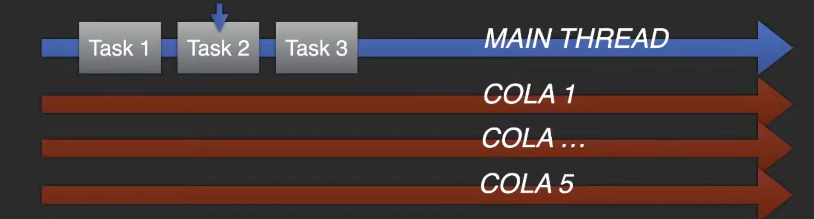
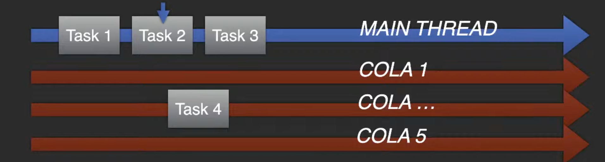
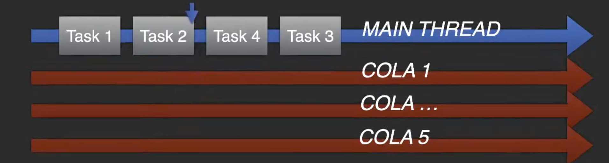
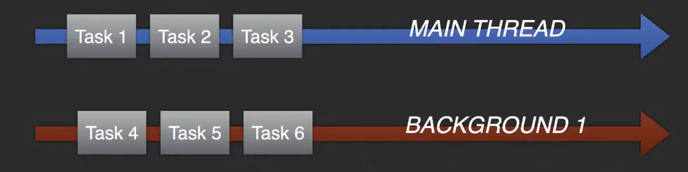
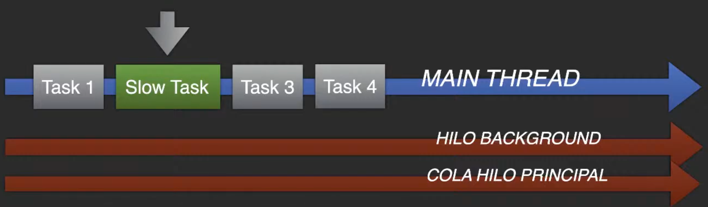
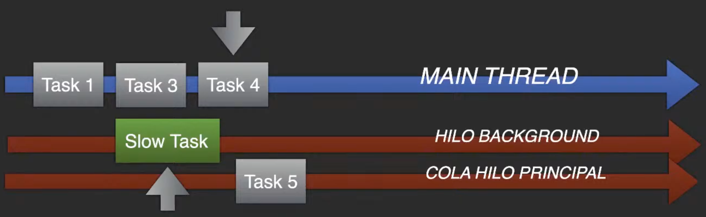
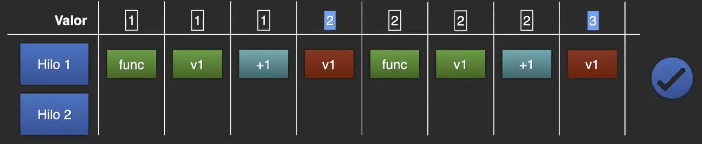

# Concurrencia Estricta en Swift 6

## Recordatorio inicial
| **Término**      | **¿Bloquea?**        | **Descripción**                                                                                       |
|-------------------|----------------------|-------------------------------------------------------------------------------------------------------|
| **Síncrono**      | Generalmente sí      | El hilo espera a que la operación termine antes de continuar.                                         |
| **Asíncrono**     | No necesariamente   | Permite delegar el trabajo y seguir ejecutando otras tareas mientras espera que la operación termine. |
| **Bloqueante**    | Sí                   | El hilo se detiene hasta que la operación completa.                                                   |
| **No bloqueante** | No                  | El hilo no se detiene; puede realizar otras tareas mientras la operación está en progreso.            |

| **Término**        | **Descripción**                                                                                     |
|---------------------|-----------------------------------------------------------------------------------------------------|
| **Serializado**     | Las tareas se ejecutan una tras otra, en orden, sin superponerse.                                   |
| **Concurrente**     | Varias tareas pueden ejecutarse al mismo tiempo en diferentes hilos o núcleos, pero sin un orden garantizado. |
| **Paralelo**        | Similar a concurrente, pero aquí varias tareas se ejecutan al mismo tiempo y efectivamente trabajan juntas, generalmente en hardware con múltiples núcleos. |
| **Secuencial**      | Todas las tareas se ejecutan en un solo hilo, siguiendo un orden estricto y garantizado.            |
| **Distribuido**     | Las tareas se ejecutan en diferentes sistemas o máquinas conectadas en red, pero pueden trabajar hacia un objetivo común. |

## ¿Qué es la concurrencia de procesos y por qué es importante?
1. La `concurrencia` es ejecutar más de una tarea a la vez.

2. Su funcionamiento se basa en el concepto de `hilo (o thread)` donde cada hilo de ejecución de CPU o GPU ejecutan una tarea de forma independiente. <br> <br>
Tenemos un hilo que hace una ejecución, hay que pensar en la concurrencia como las vías de un tren, donde pueden circular varios trenes a la vez en diferentes vías en la misma dirección pero nunca más de uno en la misma vía al mismo tiempo. <br> <br>
Es decir, las vías son los hilos y los trenes las tareas, solo puede a ver un tarea en un hilo en un mismo instante pero pueden a ver varias tareas en varios hilos en ejecución en la misma dirección (incluso en paralelo) pero cada uno en un hilo diferente. Esa en la cuestión no puede estar dos tareas en el mismo hilo, solo una hilo puede albergar una única tarea en ejecución. Además existe una restricción básica que es que un mismo pasajero no puede ir al mismo tiempo en dos trenes que van en distintas vías. <br> <br>
La concurrencia estricta evita eso, que un mismo pasajero (dato) este a al vez en distintas vias (hilos) y trenes (tareas) a la vez que van en la misma dirección, porque eso puede provocar errores e insconsistencia.

<div align="center">
  
</div> <br>

3. En sistemas Apple la concurrencia se gestiona con tres posibles APIs (o librerías):
- `GCD (Grand Central Dispatch)`: librería oficial de Apple en Swift.
Es una API en C, que pertenece al lenguaje Swift en código abierto y ha sido la solución durante los primeros años del lenguaje.

- `Operaciones (NSOperations)`: librería con Objective-C.
Es un componente de Cocoa en Objective-C, que es bastante abstracta y compleja de usar (y casi nadie la conoce).

- `Async-Await`: compatible en una API incorporada a Swift en la versión 5.5 y que se hizo `retrocompatible` hasta versión 13 de iOS y el resto de sistemas del año 2019.

## Hilos y gestión de recursos
* Cada núcleo de una CPU o GPU puede tener uno o varios hilos, según modelos y consumo.

*  En la arquitectura `ARM de Apple Silicon` cada `núcleo` maneja `un solo hilo de ejecución` para maximizar la eficienca energética.
Por lo tanto si mi Apple Silicon (M1, M2, M3..) tiene X núcleos tendra X hilos de ejecución.

* Al trabajar con múltiples hilos, si `añadimos una nueva tarea en concurrencia`, esta se `ejecutará de manera inmediata` sin importar qué otras tareas haya en otros hilos, siempre y cuando dicho `hilo este vacío`. Si no, esperará. <br> <br>
Cuando nosotros trabajamos con multiples hilos la concurrencia funciona de tal manera que se encola, es decir se mete dentro de una cola y una vez esta en esa cola busca la forma de tener un hilo disponible, de forma que si lo tiene se va a ejecutar en el momento, pero si no lo tiene disponible porque todos los hilos estan ocupados tendra que esperar a que uno quede libre y asi lo comenzará a utilizar. <br> <br>
El número de hilos disponibles tambien puede depender por ejemplo de la bateria, por ejemplo si estamos en modo ahorro de energía en el dispositivo, se quitan hilos al sistema y esto provoca que la concurrencia sea menos potente.

* Cada `hilo es secuencial` y `no puede hacer más de una tarea` (operación) a la vez por lo tanto esa es la clave para tener la concurrencia estricta. La concurrencia se basa en que muchos hilos hacen tareas a la vez pero en cada hilo no puede tener más de una operación a la vez.

## La magia de Apple Silicon: la concurrencia
- La gestión de `la concurrencia` en la mayoría de sistemas es un auténtico desastre pues solo es accesible por APIs a bajo nivel.

- La falta de formación en estos conceptos implica que la mayoría del software `use solo dos hilos`: el principal para todo, normalmente sobrecargado, y el secundario para llamadas de red que es creado por el sistema automáticamente y de forma transparente al desarrollador. <br> <br>
Mucha gente no utiliza concurrencia o no es consciente de que la esta utilizando. Cuando la gente usa un sistema operativo y este tiene una forma compleja de manejar la concurrencia de procesos al final yo no manejo esa concurrencia de procesos, al final me dedico a programar mi aplicación normal y luego hago llamadas de red y ya esta. Y como las llamadas de red que funcionan en concurrencia las crea el sistema por si solo, es totalmente transparente yo no soy conciente de que se esta usando concurrencia, de que hay un hilo que esta funcionando distinto y en paralelo y que esta haciendo una operación y que luego tengo que recuperar esa información. Normalmente no lo se porque yo resuelvo mis problemas del dia a dia de mi app y ya esta.

- La solución de Apple es tener `un gestor que analiza y determina el mejor destino` (a través de Machine Learning) en cada hilo para cada proceso de forma automática aunque todo esté programado para el hilo principal. <br> <br>
Aunque tu no programes en concurrencia, Apple recoge las solicitudes y `crea concurrencia donde no esta programada` para que no vaya todo a los primeros hilos como sucede en Android o en Windows.

## Concurrencia Estricta
- Al igual que Swift ya tiene formas en sus pilares fundacionales para evitar de forma automática gran parte de los errores que pueden provocarse en un lenguaje de programación, con la `versión 6` se incluye uno muy importante: el `data race`. <br> <br>
Swift tiene mucha caracteristicas que evitan gran parte de los errores que se tienen hoy en dia. Apple esta pasando todo a Swift. En Swift por ejemplo no existe el problema del `desbordamiento de buffer`, en Swift una cadena o un array no puede superar lo que se le ha definido, porque no se le define, es totalmente dinámico. En Swift `los errores de tipo dato incorrecto` no existen, los datos vacios estan prohibidos... <br> <br>
Apple ha metido dentro de ese control automatico por parte del lenguaje los `data race`.

- Dentro de cualquier lenguaje existen `datos mutables` cuyo acceso es compartido por cualquier recurso que quiera leerlos y/o escribirlos.<br> <br>
Los `data race` se forman cuando existen datos mutables (variables) que tienen un acceso compartido entre distintos hilos. Cuando `dos hilos distintos` van a buscar `el mismo dato, al mismo tiempo,` se genera una `desincronia`. Si dos procesos en dos hilos distintos ejecutandose a la vez de manera concurrente intentan acceder al mismo dato al mismo tiempo esa desincronía que provoca que el `dato se corrompa` y puede resultar fatal. Por ejemplo, que yo intente hacer dos sumas de '+1' y el resultado sea solo una de la sumas porque el dato origen se ha recogido dos veces.

- Swift 6, es sus errores de compilación dados en tiempo de codificación, detectará la existencia de cualquier dato de este tipo o acceso al mismo que pudiera provocar un data race: `no que lo vaya a hacer, que en dichas condiciones pueda darse`.

- La forma de solucionar esto es crear `un bloqueo de acceso` de forma natural: si alguien intenta leer un dato, el que venga después tendrá que esperar a que el primero acabe. <br>
Es decir, cuando vayas a `leer o escribir` un dato se debe de `bloquear` para que cuando `llegue otro` a hacer lo mismo tenga que esperar a que `el primero` termine para `desbloquearlo`.

- Existen varias soluciones:
    1. Bloquear el `acceso a un dato a un solo hilo` en concreto (lo que provoca que su acceso sea `serializado`).

    2. Bloquear el `acceso desde cualquier hilo` hasta que ese hilo no haya terminado.

    3. Gestionar el bloqueo de `los datos mutables individualmente`.

- La herramienta principal para poder hacer esto con `async-await` son los `actores`: clases preparadas para concurrencia (que no soportan herencia) que convierten en asíncrono (casi siempre no bloqueante) el acceso a métodos o propiedades en los mismos y con ello, obligan (con await) a esperar a todo el que quiera usarlo si alguien ya lo usa.

* `Definición de actores`: maneja el acceso seguro a datos compartidos en un entorno concurrente, solo pueden ser accedidos desde un contexto asíncrono, esto obliga al código consumidor a usar await, asegurando que el acceso se coordine correctamente. Internamente, los actores aseguran que solo una tarea pueda acceder a su estado en un momento dado, sin necesidad de que el desarrollador maneje bloqueos manuales, al delegar la gestión del acceso concurrente al sistema de ejecución de Swift. Si el actor ya está ocupado ejecutando una tarea, cualquier otra tarea que intente acceder a él será pausada (suspendida) hasta que el actor esté disponible. Sin embargo, esto no bloquea los hilos en sí, ya que las tareas que esperan son manejadas por el sistema de ejecución asíncrona.

## Tipos de tareas y funcionamiento
1. `Hilo principal (main thread)`: se encarga de la interfaz de usuario. Ejecuta las tareas de `forma síncrona y serializada`. Ejecuta la mayoria de operaciones que yo programo cuando no creo un contexto distinto. <br>
Este hilo tiene 5 colas, en las que yo puedo poner cosas para que se inyecten al hilo principal. <br> <br>
¿Cómo funcionan estas colas? Imaginamos que tenemos 3 tareas que estan dentro del hilo principal.

<div align="center">
  
</div> <br>

* La tarea 2 espera a que la 1 finalice.

* Las tareas se ejecutan secuencialmente, una tras otra: serializadamente.

* El hilo principal tiene 5 colas, que sirven para introducir tareas serializadas (individuales).

* Si marcamos una clase, struct, enumeración, método o propiedad como `@MainActor` lo estamos "atando" al `main thread` por lo que dicho método, propiedad o instancia que sea, solo será accesible en el hilo principal o instancia que sea, solo será accesible en el hilo principal y nada más y como hemos dicho este es hilo es secuencial y nos quita el problema de `los data race`.

* Si yo tengo una operación realizandola en `segundo plano`. Por ejemplo una `tarea 4` que va a poner algo en el hilo principal (esta decorada con `@MainActor`), pero entendiendo que estoy trabajando en concurrencia, lo que sucede es que esa tarea 4, al entrar en una cola se inyecta después de la tarea que el hilo principal esta realizando. Por lo que el hilo principal cambia el orden de las tareas y coloca la nueva tarea que cuando acabe seguira con la siguiente.

<div align="center">
  
</div> <br>

* De esta forma respeta la serialización del hilo (tareas una tras otra) pero puede ejecutar tareas "no esperadas".

<div align="center">
  
</div>

* Esto no afecta al rendimiento porque se espera que dichas tareas inyectadas sean siempre ligeras para el sistema. <br> <br>

Hay que entender que todos los hilos y no solo el principal sino cualquier hilo en segundo plano funcionan de manera serializada (una tras otra sin superponerse).
- Todos los `hilos` funcionan de `manera serializada`, ejecutan las tareas una a una, incluido la principal.

- Pero cuando ponemos `distintas tareas en distintos hilos` a la vez, se ejecutan en `concurrencia`, pero dentro de cada uno de sus hilos funcionan como serializadas.

<div align="center">
  
</div> <br>

- El `hilo principal` es el encargado de ejecutar la interfaz de la app. <br> <br>
Lo que no podemos olvidar es que no podemos poner `tareas lentas o pesadas` sobre el hilo principal porque estamos `parando la interfaz de la aplicación`.
- Si este encuentra una tarea pesada (más lenta), la `UI dejará de responder correctamente`.

- Todo porque la tarea lenta parará la ejecución serializada del mismo hilo donde corre `el código principal` y con ello la interfaz de nuestra app.

- Este error es muy común entre los desarrolladores y provoca apps con mala respuesta y rendimiento. <br> <br>
Cualquier `proceso que sea lento` siempre debe de estar en un `contexto secundario (task)` para poder hacerlo bien.

<div align="center">
  
</div> <br>

SE PASAR A:

<div align="center">
  
</div> <br>

- Las `buenas prácticas` nos dicen que tenemos `mover esa tarea lenta` a otro hilo funciona la UI de mejor manera ya que el hilo principal puede seguir avanzando sin problemas.

- En ese otro hilo, fuera del main, podrá ejecutarse sin entorpecer a la interfaz ni a la app y lo único que nos interesa entonces es el resultado de dicha tarea lenta.

- Una vez la `tarea lenta termina`, generamos una `nueva tarea` que se `inyecta en la cola` del hilo principal para que su resultado puede actuar sobre la interfaz de la app si ese era el propósito.

- Gracias a las nuevas medidas de `concurrencia estricta`, ya no se puede `refrescar un dato` que esté en el hilo principal desde uno en `segundo plano`, un error muy común que generaba históricamente errores en tiempo de ejecución que muchas veces eran ignorandos por los desarrolladores.

## Los 3 problemas de la concurrencia
La concurrencia presenta tres problemas que hay que tener presentes cuando se trabaja:
<<<<<<< HEAD
1. `Data race (carreras de datos)`: esto es lo que intentamos evitar con la `concurrencia estricta`. Los dos siguientes puntos son consecuencia de este punto.

2. Inversión de la prioridad.

3. Deadlock (bloqueo mortal) (cuando un hilo bloquea al otro y el otro bloquea al uno).

• Ni `NSOperation` ni `GCD` pueden evitar el `data race` de forma automática. Es decir se tiene que corregir de forma manual.

• Debemos usar buenas prácticas y/o funciones de bajo nivel de C (accesibles desde Swift) que bloquean el acceso a datos.

• Con `Async/Await` podemos hacerlo usando `actores`.

• Los `actores` son un tipo de clase sin herencia que aisla el acceso a todas sus propiedades mutables y a los métodos que las usan.

• Así mismo, el sistema proporciona un atributo de `actor global` fijado al hilo principal: el `@MainActor` (con el que decimos que esa función, método, propiedad, clase, struct van a estar atados al hilo principal). Y la posibilidad de crear nuestros `propios actores globales`.

• Adicionalmente tenemos `un protocolo` que garantiza al sistema que las propiedades mutables de una clase son seguras: `el protocolo Sendable`.

• O podemos usar `APIs de bajo nivel` como `NSLock` o `Mutex`, para bloquear ciertos datos de manera segura, sin tener que hacerlos asíncronos (bloquean el hilo, a diferenca de con `async-await` los hilos no se bloquean se van liberando según el funcionamiento). Y luego poder desbloquearlo con `setters` y `getters`.

## Data Race (condición de carrera)
Imaginar que tenemos pdos hilos` y quiero lanzar una función que va a recupar el valor que esta en memoria que es un 1 para sumarle 1:
1. Tenemos dos hilos, pero usamos solo uno para lanzar dos veces la misma función, una tras otra.

2. Aunque yo haga un v1 += 1, esto se descompone en varias instrucciones: lectura, almacenamiento en memoria, colocación en el registro de entrada de la CPU del valor actual de v1 y el 1, petición de la operación sumar, recoger el resultado, ponerlo en memoria, cambiar el puntero que apunta al antiguo valor de v1 a un nuevo lugar en memoria con el nuevo valor de v1 y fin.

3. Como vemos, `cada operación` que hacemos en Swift supone `varias instrucciones` en código máquina.

4. Pero si ejecutamos la función en `un solo hilo`, de forma `serializada`, la segunda ejecución nunca inicia hasta que acaba la primera, no tendremos ningún problema.

<div align="center">
  
</div> <br>

• Hasta `1995` las CPUs no podían trabajar en `multitarea real`. Tenían un solo núcleo y aprovechaban las pausas entre procesos (donde la CPU estaba "desocupada") para "colar" otros procesos y que "simulara" una multitarea que no era.

• En `1995` Intel revoluciona los chips con el uso del `multithreading`, un mismo núcleo tiene varios hilos en paralelo que permiten realizar tareas de forma simultánea. Fue con el Intel Pentium posteriormente con los Core I cuando introducirían el concepto `multi-núcleo`.

• `Pentium` incorporaba además `tres formas de optimizar` el uso de la CPU y conseguir con ello que los momentos en que la CPU no está haciendo nada durante un ciclo de reloj, pueda ser mejor aprovechada.

- La primera mejora es `la ejecución fuera de orden`: la CPU "desordenada" los micro-procesos en que se divide cada tarea y los ejecuta de forma agrupada por prioridad, guardando los resultados en `caché`.

- Lo que deriva en la segunda mejora: `la ejecución anticipada`. Una CPU puede procesar instrucciones (y sus micro-procesos) antes que "el tiempo real" necesite sus resultados, guardando el resultado en caché y luego solo leyendo de ahí.

- La tercera mejora es `la ejecución especulativa`: la CPU ejecuta todo, aunque no tenga seguro si lo necesitará o no. Por ejemplo: una sentencia 'if' con su 'else'. La CPU procesará ambos ámbitos antes de saber si el resultado será 'true' o 'false'. Cuando lo sepa, irá a la caché a recoger el resultado apropiado y borrará el otro.

Esto `provoca el caos` y el problema de una `desincronía`. Ejemplo:

• Si ejecutamos la `misma función` de manera concurrente en `dos hilos distintos`, el funcionamiento de la CPU creará de forma aleatoria `la condición de carrera` al dividir los procesos y alternarlos entre ambos hilos.

• Esto implica que el `hilo 1` y el `hilo 2` están accediendo al valor en memoria de forma `descoordinada` (desincronizada). Ambos hilos leen el 1 antes de modificarlo para iniciar su propio proceso de aumentar el valor. Se viene el desastre.

• En el caso de `ARM`, solo un proceso de un hilo puede pasar a la vez por el gestor para ahorrar energía. En Intel pueden pasar varios a la vez desde distintos hilos. Pero en ambos casos, el problema de desincronía es inevitable.

• Escribimos en memoria de forma `no sincronizada` el mismo resultado que parte de la misma lectura porque un proceso no esperó al otro. Todo mal.

• Dos procesos que deberían haber ejecutado dos sumas de 1 y dar como resultado 3, en realidad han devuelto ambos 2. Tenemos un `data race`. Porque no se han esperado los dos procesos se deberian haber esperado el uno al otro. ¡Y esto es lo que intenta solucionar Swift 6 con la concurrencia estricta!

<div align="center">
  
</div> <br>

• `Swift 6` prevé los escenarios donde puede darse un `data race` y los convierte en errores. `No detecta que los haya porque es imposible: solo su posibilidad en dicho escenario`.

• Si usamos una `variable global (mutable)` tendremos un error. Es decir si ponemos un 'var' a lo loco en mitad de la nada sin estar dentro de un ambito, ya tengo el primer error porque a esa variable puede acceder cualquiera.

• El patrón `singleton` que permite pasar a través de él y la modificación de propiedades mutables, también es un error si no aislamos su contexto.

• Si accedemos a un `dato mutable` desde un `closure` que captura la instancia para su integridad, igualmente error. Incluso entre el closure y otro dentro del mismo.

Si envias `clausuras (closure)` 'self.' porque puede a ver un 'data race', porque el sistema no sabe si hay otro proceso de la misma clase que va a tocar ese dato a la vez que el proceso en concurrencia.

• Si intentamos acceder a un dato atado a un hilo, como el principal (con `@MainActor`), desde otro hilo distinto dará error. Ningún dato es accesible desde hilos distintos al "atado" de forma directa.

• Podemos usar `actores` para obligar a que el acceso a las propiedades esté bloqueado mientras se usan. O `actores globales` para atar datos a contextos.

• O podemos crear `nuestras propias clases` que garanticen la seguridad de sus datos mutables entre distintos contextos y conformarlas al `protocolo Sendable`.

• Todos los `closures` que capturen datos fuera de sí mismo, están definidos como `@Sendable`, por lo que no permitirán el acceso no seguro a datos mutables.

• También podemos usar `los métodos genéricos` de bajo nivel `Mutex` o `NSLock` que permiten bloquear datos y liberarlos programáticamente.

La culpa de todo es por las clases porque ni los 'struct', ni las 'enumeraciones' sufren de `data races`, solo las clases porque son datos por referencia.

## Prioridades de las tareas
• Las prioridades para las tareas son 3: alta, medio y baja.
1. Una `tarea alta` tiene una prioridad por valor de orden de 25 y está destinada a procesos que tienen que ver con la respuesta de la app.  <br><br>
Cualquier tarea que esté interactuando con el `hilo principal` y esté `modificando la UI` y/o tenga al usuario a la espera de su conclusión (la florecita giratoria), deberá ser `alta (high)` para tener el máximo de prioridad posible. <br><br>
La prioridad `high` también tiene el nombre de `userInitiated` por compatibilidad con los valores que se usaban en `GCD`.

2. El `nivel por defecto es el medio` (medium) que se establece para tareas que el usuario no sabe que se están ejecutando, como actualizaciones de datos en segundo plano, procesos de indexación, envío de métricas a una API REST, etc...  <br><br>
Por retrocompatibilidad también es conocida como `utility` con un valor de 17.

3. La tarea de menor prioridad es la `baja (low)`, que representa que solo se ejecutará cuando no haya nada más en ese hilo (u otros) en prioridades mayores.  <br><br>
Por compatibilidad también se llama como `background` y tiene un valor de 9.

4. Por último la no especificada o `unspecified` tiene un valor de 0 y no suele usarse.

## Las herramientas en Swift 6

### Los actores (estado mutable compartido)

- Los `actores` son clases preparadas para `asincronía`.

- Sus propiedades evitan el `data race` bloqueando el acceso a cualquier propiedad, por lo que obligan al uso de sus instancias dentro de un contexto `Task` o cuando atamos un método o clase a un `actor global`.

- En la propia definición del actor, la protección a `la concurrencia es implícita` y no hay que programarla, `no` hace falta poner `async-await`, ni nada.

- Todos las propiedades mutables y los métodos que acceden a las mismas están protegidos por defecto con `aislamiento` y protección de su contexto de forma automática.

- Pero cuando creamos una instancia de un `actor`, el acceso a cualquier propiedad mutable o método que acceda a estas se vuelve de `acceso asíncrono`, siempre en un `Task`.

- Así evita que cuando `dos procesos` intenten leer a la vez un dato, puedan conseguirlo porque uno de ellos siempre queda a la `espera` que el otro termine.

- El `actor` es el ejemplo perfecto de cómo pasar un dato de un `contexto a otro`: usando para su acceso un `await` usado como elemento asíncrono.

Ejemplo de código:
```js
Counter {
    var value = 0

    func increment() -> Int {
        value = value + 1
        return value
    }
}

let counter = Counter()
// ________________________

print(counter.increment()) // Resultado: 1

print(counter.increment()) // Resultado: 2
```

Tengo un clase con un variable de valor 0 y con una funcion de incremento que a demás devuelve dicho incremento y me creo luego la instancia de la clase.
Si yo ejecuto esto, va a funcionar bien, la primera ejecución devolvera 1 y la segunda 2. <br> <br>
Pero si cada uno de estos print se ejecutaran en concurrencia en dos hilos distintos entonces ya no porque podria pasar que devolvieran dos 1 ó un 1 y un 2 ó un 2 y un 1.
Por ello la solución de esto es convertirlo en un `actor`.

```js
actor Counter {
    var value = 0

    func increment() -> Int {
        value = value + 1
        return value
    }
}

let counter = Counter()

// _____________EN FICHEROS DIFERENTES __________
// Fichero 1
Task(priority: .low) {
    print(await counter.increment()) // Resultado: 1
}

// Fichero 2
Task(priority: .low) {
    print(await counter.increment()) // Resultado: 2
}
```

Sigue siendo una clase no tengo que cambiar ninguna linea de código pero en ese momento ya no podemos acceder al método 'value' ni 'increment' si no es dentro de un entorno de una `tarea` (Task) con un `await` ya que los `actores` son `async` de manera implicita.

• Un `actor` está creado para controlar un estado mutable compartido.

• Podemos entenderlo como `un singleton` con `protección` contra `data races`.

• Todas las propiedades y métodos se `convierten en asíncronas` como miembros de instancia.

• Usamos `await` para que espere en una `cola serializada` el acceso a la propiedad.

¿Y si tenemos un método que no accede a ninguna variable? Hay que marcarlo como `nonisolated` para que permita ejecutar ese método desde un contexto cualquiera sin tener que estar dentro de un Task o de una función de tipo Async.

```js
actor MyActor {
    var count: Int = 0

    // Método aislado (por defecto en actores)
    func increment() {
        count += 1
    }

    // Método no aislado, no interactúa con el estado del actor
    nonisolated func description() -> String {
        return "Este método no accede al estado del actor."
    }
}

// Uso
let myActor = MyActor()

// Método aislado (requiere await y un contexto asincrónico)
Task {
    await myActor.increment()
}

// Método no aislado (puede llamarse directamente)
print(myActor.description()) // No requiere await
```

### Actores globales (@Globalactor)
• Un actor global nos permite generar atributos del lenguaje basados en un patrón singleton pero usando un actor en vez de una clase.
• Puede ser usado como instancia para acceder a las propiedades o métodos del actor que contiene (a través del singleton) o como atributo de cualquier clase, struct, método o propiedad y "atándola" al hilo del actor global.
Al hacer esto, estamos impidiendo que nada que no esté atado a dicho actor global pueda ser usado en otro contexto distinto.
• Al atar algo a un actor global, estamos previniendo de forma efectiva un data race, porque estamos aislando este a un hilo.
• Todos los actores funcionan en segundo plano, y actuarán de cara a cualquier elemento anotado como si fueran parte del actor, prescindiendo del uso de await.
• La base de este actor global es el mismo actor como singleton solo que luego permite anotar cualquier cosa como parte del mismo.
• O puede ser otro actor completo, al que metemos a través del singleton para usarlo con propiedades y métodos del mismo que nos permitan reutilizar código más seguro.
• La herencia del contexto del actor global es jerárquica: si marcamos una clase con un actor global, todas sus propiedades y métodos heredarán ese contexto automáticamente, a menos que se especifique lo contrario con nonisolated.
• A diferencia de los actores regulares que solo protegen sus propias propiedades, un actor global puede proteger cualquier código en cualquier parte de la aplicación, proporcionando un mecanismo de sincronización a nivel de sistema.

Esto seria un error porque aunque no se utilice una variable, si podria haberla y como el sistema no lo sabe hasta que se ejecuta daria error

```js
class APIActor {
    static let shared = APIActor()

    func fetchEmployees()
        async throws -> [Employee] {
            // ...
        }
}
```

Solución (cambiar class por actor):
Y además ahora si quier acceder al método 'fetchEmployees' tengo que acceder con un await porque es una instancia de un actor.
Pero hasta que vengo y le pongo arriba `globalActor` en ese momento yo puedo llevarme el  método 'fetchEmployees' a una clase distinta y puedo marcar esa clase como `@APIActor` (@nombreActor). Esto seria como si se metieran dentro del actor APIActor dentro de la proteccion del método 'shared', pero con la ventaja de que el método 'fetchEmployees' puede acceder a las propiedades que pertenezcan al mismo contexto APIActor sin tener que poner await,lo hace d eforma segura.

```js
@globalActor
actor APIActor {
    static let shared = APIActor()
}

@APIActor
final class EmployeeAPI {
    func fetchEmployees()
        async throws -> [Employee] {
            // ...
        }
}
```

Que pasa ahora tengo mi VM (View Model) que tiene mi '@Observable' y este esta unido al '@MainActor' porque la interfaz va en el '@MainActor' y el array de empleados va en el '@MainActor' porque se va a mostrar en pantalla y la API que es dodne voy a recuperar la información que es lo que viene de 'APIActor'.
Lo que sucede es que cuando hago la carga de la función 'loadEmployees' tengo que marcar para poder acceder a 'api.fetchEmployees' la propiedad '@APIActor'.
Ojo ya tengo los datos cargados en la función 'loadEmployees', ¿ahora como lospongo en la propiedad 'employees' que pertenece al '@MainActor' que es otro distinto a '@APIActor' que esta funcionando en segundo plano, '@MainActor' desta en primer plano, ¿como les paso a la propiedad 'employees'? Pues se tendira que hacer a través de una tarea marcada con el atributo '@MainActor', lo que se esta haciendo es crear un nuevo contexto que usa el '@MainActor' y sale del '@APIActor' por lo que ahora ya se puede hacer el 'self.employees' sin ningún problema. Pero entonces tnedriamos otro error porque la función 'loadEmployees' pertenece como propiedad a '@APIActor' y si yo quiero capturarla no puedo porque la captura semantica no es permitida porque puede ser que debajo del 'Task' alguien  modificase 'loadEmployees' (yo no tengo la garantia de que el Task { @MainActor in ... } se eejcute después o antes de esa modificación porque hya tendria un 'data races'). Entonces la solución es poner entre corchetes el 'loadEmployees' para hacer una copia por valor de loadEmployees para que de igual lo que pase después.

```js
@globalActor
actor APIActor {
    static let shared = APIActor()
}

@APIActor
final class EmployeeAPI {
    func fetchEmployees()
        async throws -> [Employee] {
            // ...
        }
}

//_________________NUEVO_________________
@Observable @MainActor
final class EmployeeStore {
    var employees: [Employees]
    let api: EmployeeAPI

    @APIActor
    func loadEmployees() async {
        do {
            let loadedEmployees =
                try await api.fetchEmployees()
            Task { @MainActor [loadedEmployees] in
                self.employees = loadedEmployees
            }
        } catch {
            // ...
        }
    }
}
```

### Actor principal
• El actor principal es la instancia de un actor global, que está unido a todos los procesos que se realizan en el hilo principal.
• Como cualquier actor global, puede ser usado como instancia o como atributo marcando, en este caso, la unión al hilo principal (con @MainActor).
• Por un lado permite inyectar cualquier dependencia desde otro contexto de ejecución, directamente al hilo principal, con control de cualquier data race.
• O también permite marcar un closure, tipo de dato, método, clase, struct o incluso un protocolo para que solo pueda ser usado en el hilo principal.
• En esencia, ata el proceso a este hilo impidiendo que ningún dato marcado con él pueda ser usado en cualquier otro contexto.
• Pero no podemos olvidar que todo lo que esté en el MainActor estará en el hilo principal, por lo que puede causar problemas de rendimiento si hacemos una tarea síncrona pesada.
• No obstante, cualquier await que hagamos en un Task, que esté unido al MainActor, buscará su propio contexto de ejecución para realizar la tarea y liberará el hilo principal para otras operaciones encoladas.
• Cuando el proceso asíncrono con await termina, se vuelve a inyectar sobre el hilo principal y se sigue serializando, evitando el data race pero SIN parar el hilo principal.
• De hecho, es igual con cualquier otro actor global, siempre que usemos algo async.

### El protocolo Sendable
• El protocolo Sendable es un protocolo que cumple cualquier dato que de forma segura puede pasar su datos entre distintos contextos.
• Esto se consigue garantizando el aislamiento y/o bloqueo del dato entre cuando es accedido para lectura y/o modificado en forma alguna. Mientras se lee o toca el dato, este debe estar bloqueado para que nadie más acceda a él.
• Los structs, enumeraciones y todos los tipos naturales del sistema (Int, String, etc...) son de tipo Sendable, así como muchos de Cocoa Touch como UIView o UIImage que son clases pero tienen sus propiedades aisladas.
• Si creamos una clase y dentro de la misma no hay ninguna propiedad mutable (ningún var), dicha clase podrá conformarse con Sendab le y podrá ser usada sin problema para pasar y/o capturar datos entre distintos contextos.
• Pero si queremos que una clase con una variable (o varias) sean Sendable, tenemos que bloquearlas con garantías para que cumplan el protocolo.
• Las formas son muchas: podemos crear un actor privado dentro de la clase que gestiona la mutabilidad (aunque los accesos serán async).
• O también podemos usar las APIs de NSLock del sistema para crear un patrón setter/ getter aislado por tipos que bloqueo y que se libere en cada lectura o escritura.
• Si usamos iOS 18 otra solución es usar Mutex en la librería Synchronization.

### Conclusiones
¿Hay formas de saltarse todo esto? Sí. Pero estás entrando en un terreno peligroso porque el lenguaje a partir de Swift 6 supone que haces las cosas bien y te vas a encontrar con procesos bloqueados vistas que no funcionan, llamadas a APIs que nunca llegan... anular es SOLO cuando el sistema tiene APis aún no adaptadas.
• Cualquier propiedad o método que nos de igual que pueda sufrir data race o que podamos garantizar que no va a sufrirlo, pero sin una implementación que lo garantice, puede ser marcado con nonisolated (unsafe) y con ello nos dejará hacer lo que queramos. Bajo nuestra responsabilidad y sabiendo que podríamos tener problemas de estabilidad en nuestros desarrollos.
• De igual forma, cualquier clase que necesitemos que sea Sendable, pero no lo sea, con el sufijo @unchecked lo permitirá que pase por una sin serlo realmente.
• En estos próximos meses podremos ver algunas veces estas instrucciones de "anulación" de la concurrencia, mientras ciertas APis se van adaptando, pero siempre sabiendo muy bien a qué nos enfrentamos.
• Hoy, el modo Swift 5 y Swift 6 es elegible. No tenemos por qué pasar a Swift 6 y podemos minimizar el número de warnings.
Pero Apple no se la va a jugar y en Xcode 17 es probable que el modo Swift 6 sea obligatorio, lo que obligaría a todos a adaptar sus apps para primavera de 2026.
Más vale empezar ya, vaya que nos pille el pájaro enfadado.

# Preguntas
- ¿Si nuestra clase no podemos pasarla a un actor porque se trata de un VM (View Model) marcado con observables (@Observable), cual sería la alternativa en ese caso?
El `@Globalactor` que marca ciertos métodos de ese VM para aislarlos a un hilo en concreto, es el ejemplo puesto del `@Globalactor` con el `@APIActor`.
Porque ya sabemos que un @Observable no puede ser Sendable pero si puede estar atado a un hilo y dentro de hay los distintos métodos pueden estar atados a otros actores globales.

Lo más recomendable es marcar siempre todo el VM como `@MainActor`, es la forma más sencilla.

